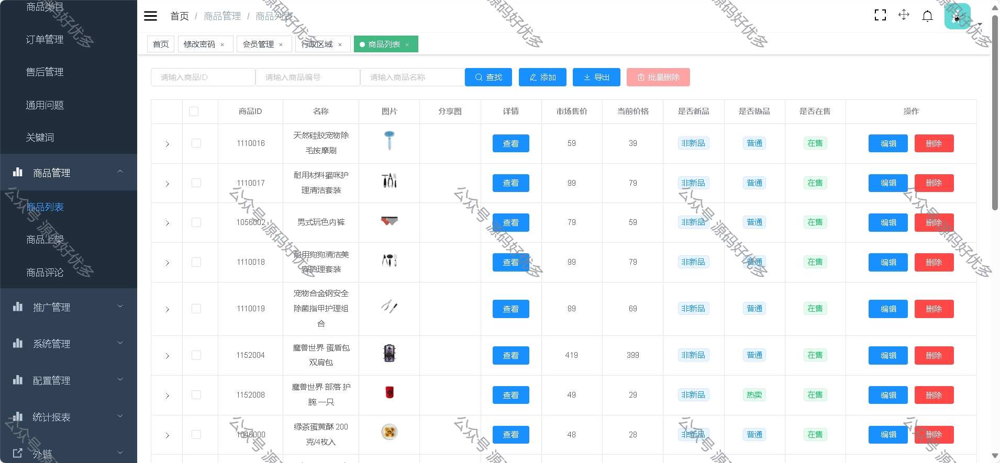

 
## 查看主页获取源码

> **作者介绍**： **✌**全网粉丝10W+本平台特邀作者、博客专家、CSDN新星计划导师、java领域优质创作者,博客之星、掘金/华为云/阿里云/InfoQ等平台优质作者、专注于项目实战 **✌**

  

### 一、作品包含

源码+数据库+全套环境和工具资源+部署教程

### 二、项目技术

前端技术：Html、Css、Js、Vue、Element-ui

数据库：MySQL

后端技术：Java、Spring Boot、MyBatis

  

### 三、运行环境

开发工具：IDEA，微信开发者工具

数据库：MySQL5.7

数据库管理工具：Navicat10以上版本

环境配置软件： JDK1.8+Maven3.6.3

前端Nodejs：14

### 四、项目介绍
项目编号：mpweixinA001

商城小程序，旨在为商家提供便捷的电商解决方案，同时为消费者打造一个流畅、便捷、多样化的购物环境，让交易更加简单，让购物成为一种享受

小商城功能：
首页
专题列表、专题详情
分类列表、分类详情
品牌列表、品牌详情
新品首发、人气推荐
优惠券列表、优惠券选择
团购
搜索
商品详情、商品评价、商品分享
购物车
下单
订单列表、订单详情、订单售后
地址、收藏、足迹、意见反馈
客服

管理平台功能：
会员管理
商城管理
商品管理
推广管理
系统管理
配置管理
统计报表

### 五、运行截图

  
